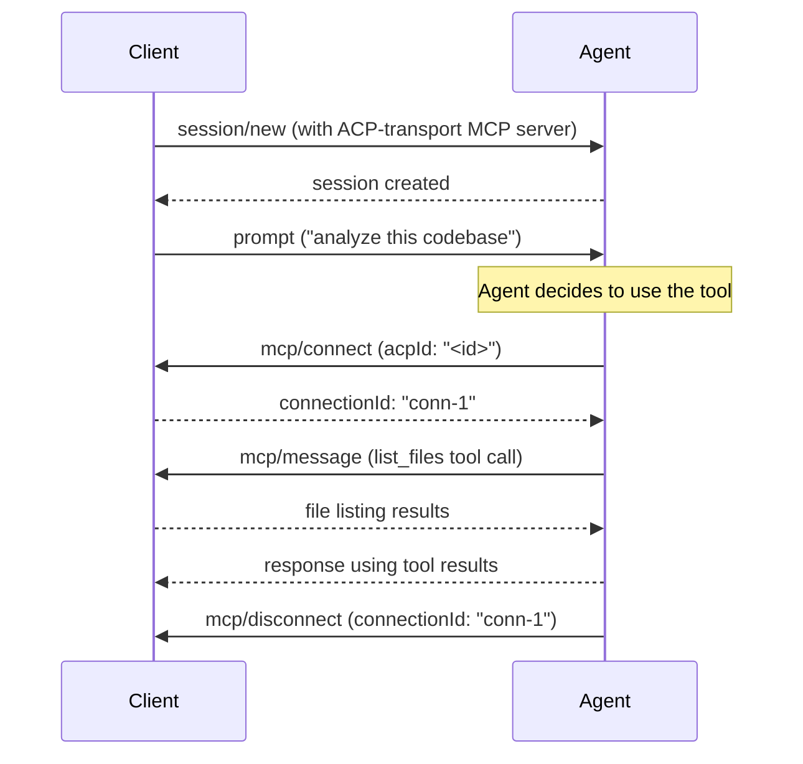
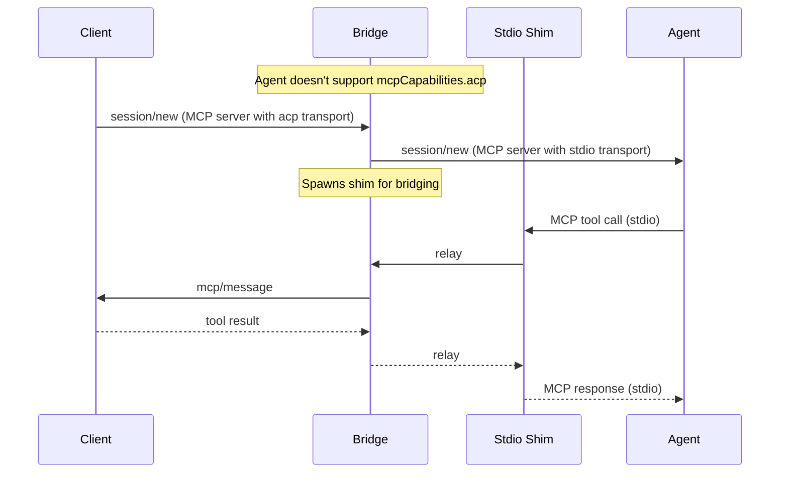

> ## Documentation Index
> Fetch the complete documentation index at: https://agentclientprotocol.com/llms.txt
> Use this file to discover all available pages before exploring further.

# MCP-over-ACP: MCP Transport via ACP Channels

Author(s): [nikomatsakis](https://github.com/nikomatsakis)

## Elevator pitch

> What are you proposing to change?

Add support for MCP servers that communicate over ACP channels instead of stdio or HTTP. This enables any ACP component to provide MCP tools and handle callbacks through the existing ACP connection, without spawning separate processes or managing additional transports.

## Status quo

> How do things work today and what problems does this cause? Why would we change things?

ACP and MCP each solve different halves of the problem of interacting with an agent. ACP stands in "front" of the agent, managing sessions, sending prompts, and receiving responses. MCP stands "behind" the agent, providing tools that the agent can use to do its work.

Many applications would benefit from being able to be both "in front" of the agent and "behind" it. This would allow a client, for example, to create custom MCP tools that are tailored to a specific request and which live in the client's address space.

The only way to combine ACP and MCP today is to use some sort of "backdoor", such as opening an HTTP port for the agent to connect to or providing a binary that communicates with IPC. This is inconvenient to implement but also means that clients cannot be properly abstracted and sandboxed, as some of the communication with the agent is going through side channels. Imagine trying to host an ACP component (client, agent, or [agent extension](./proxy-chains.mdx)) that runs in a WASM sandbox or even on another machine: for that to work, the ACP protocol has to encompass all of the relevant interactions so that messages can be transmitted properly.

## What we propose to do about it

> What are you proposing to improve the situation?

We propose adding `"acp"` as a new MCP transport type. When an ACP component (client or proxy) adds an MCP server with ACP transport to a session, tool invocations for that server are routed back through the ACP channel to the component that provided it.

This enables patterns like:

* A **client** that injects project-aware tools into every session and handles callbacks directly
* An **[agent extension](./proxy-chains.mdx)** that adds context-aware tools based on the conversation state
* A **bridge** that translates ACP-transport MCP servers to stdio for agents that don't support native ACP transport

### How it works

When the client connects, the agent advertises MCP-over-ACP support via `mcpCapabilities.acp` in its `InitializeResponse`. If supported, the client can add MCP servers to a `session/new` request with `"transport": "acp"` and an `id` that identifies the server:

```json  theme={null}
{
  "tools": {
    "mcpServers": {
      "project-tools": {
        "transport": "acp",
        "id": "550e8400-e29b-41d4-a716-446655440000"
      }
    }
  }
}
```

The `id` is generated by the component providing the MCP server.

When the agent connects to the MCP server, an `mcp/connect` message is sent with the MCP server's `id`. This returns a fresh `connectionId`. MCP messages are then sent back and forth using `mcp/message` requests. Finally, `mcp/disconnect` signals that the connection is closing.

### Bridging and compatibility

Existing agents don't support ACP transport for MCP servers. To bridge this gap, a wrapper component can translate between ACP-transport MCP servers and the stdio/HTTP transports that agents already support. The wrapper spawns shim processes or HTTP servers that the agent connects to normally, then relays messages to/from the ACP channel.

We've implemented this bridging as part of the conductor described in the [Proxy Chains RFD](./proxy-chains). The conductor always advertises `mcpCapabilities.acp: true` to its clients, handling the translation transparently regardless of whether the downstream agent supports native ACP transport.

### Message flow example



## Shiny future

> How will things play out once this feature exists?

### Seamless tool injection

Components can provide tools without any process management. A Rust development environment could inject cargo-aware tools, a cloud IDE could inject deployment tools, and a security scanner could inject vulnerability checking - all through the same ACP connection they're already using.

### WebAssembly-based tooling

Components running in sandboxed environments (like WASM) can provide MCP tools without needing filesystem or process spawning capabilities. The ACP channel is their only interface, and that's sufficient.

### Transparent bridging

For agents that don't natively support ACP transport, intermediaries can transparently bridge: accepting MCP-over-ACP from clients and spawning stdio- or HTTP-based MCP servers that the agent can use normally. This provides backwards compatibility while allowing the ecosystem to adopt ACP transport incrementally.

## Implementation details and plan

> Tell me more about your implementation. What is your detailed implementation plan?

### Capability advertising

Agents advertise MCP-over-ACP support via the [`mcpCapabilities`](/protocol/schema#mcpcapabilities) field in their `InitializeResponse`. We propose adding an `acp` field to this existing structure:

```json  theme={null}
{
  "capabilities": {
    "mcpCapabilities": {
      "http": false,
      "sse": false,
      "acp": true
    }
  }
}
```

When `mcpCapabilities.acp` is `true`, the agent can handle MCP servers declared with `"transport": "acp"` natively - it will send `mcp/connect`, `mcp/message`, and `mcp/disconnect` messages through the ACP channel.

Clients don't need to advertise anything - they simply check the agent's capabilities to determine whether bridging is needed.

**Bridging intermediaries**: An intermediary that provides bridging can present `mcpCapabilities.acp: true` to its clients regardless of whether the downstream agent supports it, handling bridging transparently (see [Bridging](#bridging-for-agents-without-native-support) below).

### MCP transport schema extension

We extend the MCP JSON schema to include ACP as a transport option:

```json  theme={null}
{
  "type": "object",
  "properties": {
    "transport": {
      "type": "string",
      "enum": ["stdio", "http", "acp"]
    }
  },
  "allOf": [
    {
      "if": { "properties": { "transport": { "const": "acp" } } },
      "then": {
        "properties": {
          "id": {
            "type": "string"
          }
        },
        "required": ["id"]
      }
    }
  ]
}
```

### Message reference

**Connection lifecycle:**

```json  theme={null}
// Establish MCP connection
{
  "method": "mcp/connect",
  "params": {
    "acpId": "550e8400-e29b-41d4-a716-446655440000",
    "meta": { ... }
  }
}
// Response:
{
  "connectionId": "conn-123",
  "meta": { ... }
}

// Close MCP connection
{
  "method": "mcp/disconnect",
  "params": {
    "connectionId": "conn-123",
    "meta": { ... }
  }
}
```

**MCP message exchange:**

```json  theme={null}
// Send MCP message (bidirectional - works agent→client or client→agent)
{
  "method": "mcp/message",
  "params": {
    "connectionId": "conn-123",
    "method": "<MCP_METHOD>",
    "params": { ... },
    "meta": { ... }
  }
}
```

The inner MCP message fields (`method`, `params`) are flattened into the params object. Whether the wrapped message is a request or notification is determined by the presence of an `id` field in the outer JSON-RPC envelope, following JSON-RPC conventions.

### Routing by ID

The `acpId` in `mcp/connect` matches the `id` that was provided by the component when it declared the MCP server in `session/new`. The receiving side uses this `id` to route messages to the correct handler.

When a component provides multiple MCP servers in a single session, each gets a unique `id`, enabling proper message routing.

### Connection multiplexing

Multiple connections to the same MCP server are supported - each `mcp/connect` returns a unique `connectionId`. This allows scenarios where an agent opens multiple concurrent connections to the same tool server.

### Bridging for agents without native support

Not all agents will support MCP-over-ACP natively. To maintain compatibility, it is possible to write a bridge that translates ACP-transport MCP servers to transports the agent does support.

**Bridging approaches:**

* **Stdio shim**: Spawn a small shim process that the agent connects to via stdio. The shim relays MCP messages to/from the ACP channel. This is the most compatible approach since all MCP-capable agents support stdio.

* **HTTP bridge**: Run a local HTTP server that the agent connects to. MCP messages are relayed to/from the ACP channel. This works for agents that prefer HTTP transport.

**How bridging works:**

When a client provides an MCP server with `"transport": "acp"`, and the agent doesn't advertise `mcpCapabilities.acp: true`, a bridge can:

1. Rewrite the MCP server declaration in `session/new` to use stdio or HTTP transport
2. Spawn the appropriate shim process or HTTP server
3. Relay messages between the shim and the ACP channel

From the agent's perspective, it's talking to a normal stdio/HTTP MCP server. From the client's perspective, it's handling MCP-over-ACP messages. The bridge handles the translation transparently.



A first implementation of this bridging exists in the `sacp-conductor` crate, part of the proposed new version of the [ACP Rust SDK](https://github.com/anthropics/rust-sdk).

## Frequently asked questions

> What questions have arisen over the course of authoring this document or during subsequent discussions?

### Why use a separate `id` instead of server names?

Server names in `mcpServers` are chosen by whoever adds them to the session, and could potentially collide if multiple components add servers. A component-generated `id` provides guaranteed uniqueness and allows the providing component to correlate incoming messages back to the correct session context.

This also avoids a potential deadlock: some agents don't return the session ID until after MCP servers have been initialized. Using a component-generated `id` avoids any dependency on agent-provided identifiers.

### How does this relate to proxy chains?

MCP-over-ACP is a transport mechanism that works independently of proxy chains. However, proxy chains are a natural use case: a proxy can inject MCP servers into sessions it forwards, handle the tool callbacks, and use the results to enhance its transformations.

See the [Proxy Chains RFD](./proxy-chains) for details on how MCP-over-ACP enables context-aware tooling.

### What if the agent doesn't support ACP transport?

See the [Bridging for agents without native support](#bridging-for-agents-without-native-support) section above. A bridge can transparently translate ACP-transport MCP servers to stdio or HTTP for agents that don't advertise `mcpCapabilities.acp` support.

### What about security?

MCP-over-ACP has the same trust model as regular MCP: you're allowing a component to handle tool invocations. The difference is transport, not trust. Components should only add MCP servers from sources they trust, same as with stdio or HTTP transport.

## Revision history

Split from proxy-chains RFD to enable independent use of MCP-over-ACP transport by any ACP component, not just proxies.
