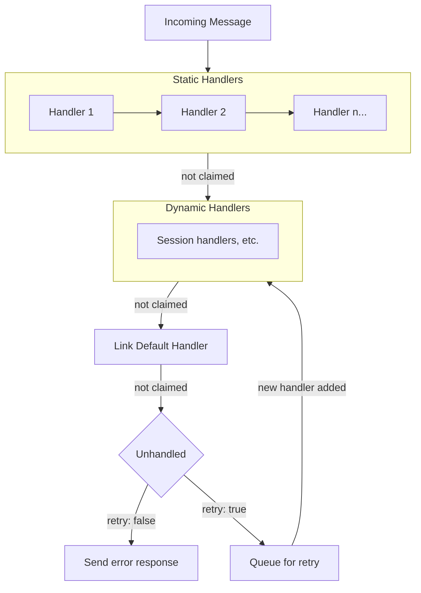

> ## Documentation Index
> Fetch the complete documentation index at: https://agentclientprotocol.com/llms.txt
> Use this file to discover all available pages before exploring further.

# Rust SDK based on SACP

Author(s): [nikomatsakis](https://github.com/nikomatsakis)

## Elevator pitch

> What are you proposing to change?

Replace the current ACP Rust SDK with a new implementation based on SACP (Symposium ACP). The new SDK provides a component-based architecture with builder patterns, explicit message ordering guarantees, and first-class support for [Proxy Chains](./proxy-chains) and [MCP-over-ACP](./mcp-over-acp).

## Status quo

> How do things work today and what problems does this cause? Why would we change things?

The current `agent-client-protocol` crate has a straightforward design with trait-based callbacks for common ACP methods and well-typed requests and responses. It's convenient for simple purposes but quickly becomes awkward when attempting more complex designs.

Two examples that we found pushed the limits of the design are the *conductor* (from the [proxy chains](./proxy-chains) RFD) and the [patchwork-rs](https://patchwork-lang.github.io/patchwork-rs/) project:

The Conductor is an orchestrator that routes messages between proxies, agents, and MCP servers. It must adapt messages as they flow through the system and maintain the correct ordering.

Patchwork is a programmatic interface for working with agents. It allows Rust programs to run prompts that provide custom tools (implemented using [MCP-over-ACP](./mcp-over-acp)) and messages:

```rust  theme={null}
let mut results = Vec::new();

let _: () = patchwork.think()
    .text("Process each item and record it using the `record` tool")
    .tool(
        "record",
        "Record a processed item",
        async |input: RecordInput, _cx| {
            results.push(input.item);
            Ok(RecordOutput { success: true })
        },
        acp::tool_fn_mut!(),
    )
    .await?;

// After the think block, `results` contains all recorded items
println!("Recorded: {:?}", results);
```

### Limitation: Handlers can't send messages

The current SDK uses traits like `Agent` where handler methods receive only the request and return only the response:

```rust  theme={null}
#[async_trait]
pub trait Agent {
    async fn prompt(&self, args: PromptRequest) -> Result<PromptResponse>;
    // ...
}
```

There's no (easy) way to send messages back to the client from within a handler. If you want to send a `SessionNotification` while processing a prompt, you need to obtain an `AgentSideConnection` through some other means and coordinate access yourself.

This is awkward for agents (which want to stream progress during prompt processing) and prohibitive for proxies (which need to forward messages to their successor while handling a request from their predecessor).

**Goal:** Handlers should receive a context parameter that provides methods to send requests and notifications back through the connection.

### Limitation: Fixed set of handlers

ACP is an extensible protocol where users can add their own method names beginning with `_`. The current SDK uses a trait which means that it cannot offer "first-class" support for user-defined requests/notifications. Instead, these are handled using extension methods (`ext_method`, `ext_notification`). These methods have no static typing and require the user to work with raw JSON.

**Goal:** Allow SDK users to define their own request/notification types that are handled in the same fashion as built-in types.

### Limitation: Message handlers must be the same across all session

The current API always executes the same handler code for a particular method (e.g., a session/update). If different handling is required for a particular session, that handler must maintain some kind of map from session-id to identify what handling is required, which is non-trivial bookkeeping that can become awkward. As an example of how complex this can get, consider the [elaborate message forwarding scheme](https://nikomatsakis.github.io/threadbare/agent.html#full-trace-nested-think) used by older versions of patchwork.

**Goal:** Allow SDK users to add/remove "dynamic" handlers that are specific to a particular session or other part of the protocol. These handlers should be closures so they can capture state.

### Limitation: No ordering guarantees

In the current SDK, every incoming request or notification results is handled in a freshly spawned task. This means that it is not possible to guarantee that requests or notifications are handled in the order they arrive. It is also not possible to be sure that a notification is fully handled before the response to another request; this makes it difficult to, for example, be sure that a `session/update` notification is handled before the turn is ended (which is sent as the response to the `prompt` request). This is essential for an application like patchwork, which wishes to fully capture the updates before returning.

**Goal:** Handlers should block message processing to allow them to ensure that they fully process a message before other messages are processed.

### Limitation: Confusing naming and 1:1 assumption

`AgentSideConnection` is ambiguous - does this represent the agent, or the connection *to* an agent? What's more, the SDK currently assumes that each connection has a single peer, but [proxies](./proxy-chains) may wish to send/receive messages from multiple peers (client or agent). This was a constant source of confusion in early versions of the conductor and frequently required the author to get out a pencil and paper and work things out very carefully.

**Goal:** Use directional naming like `ClientToAgent` that makes relationships explicit: "I am the client, the remote peer is an agent." Enable multiple peers.

### Limitation: Awkward to connect components

When building tests and other applications, it's convenient to be able to create a client and connect it directly to an agent, leaving the plumbing to the framework. The current SDK only accepts channels and byte-streams which creates unnecessary boilerplate.

**Goal:** Provide a `Component` trait that abstracts over anything that can connect to an ACP transport, enabling uniform handling in orchestration scenarios.

### Challenge: Executor independence and starvation freedom

This isn't a limitation of the current SDK per se, but a common pitfall in async Rust designs that we want to address.

We want the SDK to be independent from specific executors (not tied to tokio) while still supporting richer patterns like spawning background tasks. One specific common issue with Rust async APIs is *starvation*, which can occur with stream-like APIs where it is important to keep awaiting the stream so that items make progress. For example, in a setup like this one, the "connection" is not being "awaited" while each message is handled:

```rust  theme={null}
// PROBLEMATIC: message handling starves while processing
while let Some(message) = connection.next().await {
    process(message).await; // connection is quiescent during this await!
}
```

With careful design, it is possible to avoid these hazards. The most common way is either to spawn tasks (which then ties one to a specific executor) or to use "interior iteration" style APIs like `for_each` or `run_until`:

```rust  theme={null}
// CORRECT: message handling continues concurrently
connection.run_until(async |cx| {
    // The connection processes messages while this code runs
    let response = cx.send_request(request).block_task().await?;
    process(response).await
}).await
```

**Goal:** Provide APIs that are starvation-free by design, making it difficult to accidentally block message processing.

## What we propose to do about it

> What are you proposing to improve the situation?

We propose to adopt the design and implementation from [`sacp`](https://github.com/symposium-dev/symposium-acp/) (developed as part of the [Symposium project](https://symposium.dev)) as the foundation for `agent-client-protocol` v1.0. The `sacp` crates will be imported into this repository and renamed:

| Current             | New name                             |
| ------------------- | ------------------------------------ |
| `sacp`              | `agent-client-protocol` (v1.0)       |
| `sacp-derive`       | `agent-client-protocol-derive`       |
| `sacp-tokio`        | `agent-client-protocol-tokio`        |
| `sacp-rmcp`         | `agent-client-protocol-rmcp`         |
| `sacp-conductor`    | `agent-client-protocol-conductor`    |
| `sacp-test`         | `agent-client-protocol-test`         |
| `sacp-tee`          | `agent-client-protocol-tee`          |
| `sacp-trace-viewer` | `agent-client-protocol-trace-viewer` |

The `sacp` crates will then be deprecated in favor of the `agent-client-protocol` family. The new SDK addresses the limitations above through a builder-based API with explicit connection semantics.

The following table summarizes the key API concepts and which goals they address:

| API Concept                                                                         | Goals Addressed                           |
| ----------------------------------------------------------------------------------- | ----------------------------------------- |
| [Link types](#link-types-and-directional-naming) (`ClientToAgent`, `AgentToClient`) | Confusing naming, 1:1 assumption          |
| [`Component` trait + `connect_to`](#the-component-trait-and-connect_to)             | Awkward to connect components             |
| [Connection context (`cx`)](#sending-messages)                                      | Handlers can't send messages              |
| [`on_receive_*` handlers](#handling-messages) with closure types                    | Fixed set of handlers                     |
| [`serve` / `run_until`](#running-connections-serve-and-run_until)                   | Executor independence, starvation freedom |
| [Session builders + dynamic handlers](#session-builders-and-mcp-servers)            | Handlers must be same across sessions     |
| [Ordering guarantees + `spawn`](#controlling-ordering)                              | No ordering guarantees                    |

We have validated the design by implementing a number of use cases:

* **sacp-conductor** (to be renamed **agent-client-protocol-conductor**) - implementation of the conductor from the [proxy chains](./proxy-chains) RFD
* [Patchwork](https://patchwork-lang.github.io/patchwork-rs/) - programmatic agent orchestration
* **elizacp** - agent implementing the classic ELIZA program
* **agent-client-protocol-tee** - proxy that logs messages before forwarding
* **yopo** ("You Only Prompt Once") - CLI tool for single prompts

The [Deep dive](#deep-dive) section below walks through each concept in detail.

## Deep dive

This section walks through the SDK concepts in detail, organized by what you're trying to do.

### Getting up and going

#### Link types and directional naming

The SDK is organized around *link types* that describe who you are and who you're talking to. The two most common examples are:

* `ClientToAgent` - "I am a client, connecting to an agent"
* `AgentToClient` - "I am an agent, serving a client"

To build a connection, start with the link type and invoke the `builder` method. Builders use the typical "fluent" style:

```rust  theme={null}
// As a client connecting to an agent
ClientToAgent::builder()
    .name("my-client") // optional, useful for tracing
```

```rust  theme={null}
// As an agent serving clients
AgentToClient::builder()
    .name("my-agent") // optional, useful for tracing
```

Most types in the SDK are parameterized by the link type. This helps document the intent of the connection and also determines default method handling when no event handler is registered. (Both `ClientToAgent` and `AgentToClient` generally error on unhandled messages, but proxies default to forwarding.)

#### The `Component` trait and `connect_to`

The `connect_to` method connects your builder to the other side. The argument can be anything that implements the `Component<Link>` trait, which abstracts over anything that can communicate via JSON-RPC:

```rust  theme={null}
// Connect to an agent over stdio
ClientToAgent::builder()
    .connect_to(acp::stdio())
```

The `AcpAgent` type allows connecting to an external ACP agent or agent extension:

```rust  theme={null}
// Connect to a specific agent by command
ClientToAgent::builder()
    .connect_to(AcpAgent::from_str("some-command --acp"))

// Connect to Zed's Claude Code integration
ClientToAgent::builder()
    .connect_to(AcpAgent::zed_claude_code())
```

For testing, you can connect builders directly to each other - no transport setup required:

```rust  theme={null}
ClientToAgent::builder()
    .connect_to(AgentToClient::builder())
```

Or connect to a struct that implements `Component`:

```rust  theme={null}
impl Component<AgentToClient> for MyAgent {
    async fn serve(self, client: impl Component<ClientToAgent>) -> Result<(), acp::Error> {
        AgentToClient::builder()
            .on_receive_request(/* ... */)
            .serve(client)
            .await
    }
}

// Connect client directly to agent - useful for testing
ClientToAgent::builder()
    .connect_to(MyAgent::new())
```

#### Running connections: `serve` and `run_until`

The `connect_to` method returns a `JrConnection`, but that connection is inert until executed. There are two ways to run it.

**`serve()`** runs until the connection is closed. This is for "reactive" components that respond to incoming messages:

```rust  theme={null}
AgentToClient::builder()
    .name("my-agent")
    .on_receive_request(/* ... */)
    .connect_to(transport)?
    .serve()
    .await
```

**`run_until()`** takes an async closure and runs your code concurrently with message handling. The closure receives a *connection context* (conventionally called `cx`) - this is how you interact with the connection, sending messages, spawning tasks, and adding dynamic handlers. When the closure returns, the connection closes:

```rust  theme={null}
ClientToAgent::builder()
    .name("my-client")
    .connect_to(transport)?
    .run_until(async |cx| {
        // Your code runs here while messages are handled in the background.
        // Use `cx` to send requests and notifications.
        let response = cx.send_request(InitializeRequest::new(ProtocolVersion::LATEST))
            .block_task().await?;
        Ok(response)
    })
    .await
```

The `run_until` pattern directly addresses starvation. Instead of exposing an async stream that users might accidentally block, `run_until` runs your code *concurrently* with message handling.

The `cx` type (`JrConnectionCx`) follows the "handle" pattern: cloned values refer to the same connection. It's `'static` so it can be sent across threads or stored in structs. Handlers registered with `on_receive_*` also receive a `cx` parameter.

### Sending messages

#### Sending notifications

Use `cx.send_notification()` to send a notification. It returns a `Result` that is `Err` if the connection is broken:

```rust  theme={null}
cx.send_notification(StatusNotification::new("processing"))?;
```

#### Sending requests

Use `cx.send_request()` to send a request. This returns a handle for managing the response:

```rust  theme={null}
let response_handle = cx.send_request(PromptRequest::new(session_id, messages));
```

The handle is not the response itself - that may not have arrived yet. You have two options for getting it:

**`on_response` / `on_ok_response`** registers a handler that runs when the response arrives:

```rust  theme={null}
cx.send_request(PromptRequest::new(session_id, messages))
    .on_ok_response(
        async move |response: PromptResponse, cx| {
            println!("Agent finished: {:?}", response.stop_reason);
            Ok(())
        },
        acp::on_response!()
    )?;
```

**`block_task`** returns a future you can await:

```rust  theme={null}
let response: PromptResponse = cx.send_request(PromptRequest::new(session_id, messages))
    .block_task()
    .await?;
```

The `block_task` approach is convenient but dangerous in handlers (methods that begin with `on_`). See [Controlling ordering](#controlling-ordering) for details.

### Controlling ordering

#### Atomic handlers

Handler methods (methods whose names begin with `on_`) execute in the order messages arrive. Each handler must complete before the next message is processed:

```rust  theme={null}
.on_receive_request(async |req: PromptRequest, request_cx, cx| {
    // No other messages will be processed while this runs
    cx.send_notification(StatusNotification::new("processing"))?;
    // The notification is guaranteed to be sent before the response
    request_cx.respond(PromptResponse::new(StopReason::EndTurn))
}, acp::on_receive_request!())
```

#### `block_task` and deadlock

Using `block_task` inside a handler creates a deadlock: the handler waits for a response, but responses can't be processed until the handler completes.

```rust  theme={null}
// WRONG - will deadlock
.on_receive_request(async |req: PromptRequest, request_cx, cx| {
    let response = cx.send_request(SomeOtherRequest::new())
        .block_task()  // Deadlock! Handler blocks waiting for response
        .await?;       // but responses can't be processed until handler returns
    request_cx.respond(/* ... */)
}, acp::on_receive_request!())
```

Use `on_response` instead, or spawn a task.

#### Spawning tasks

Use `cx.spawn` to run work concurrently with message handling:

```rust  theme={null}
.on_receive_request(async |request: PromptRequest, request_cx, cx| {
    cx.spawn(async move {
        // Safe to use block_task here - we're in a spawned task
        let response = cx.send_request(InitializeRequest::new(ProtocolVersion::LATEST))
            .block_task()
            .await?;
        /* ... */
        Ok(())
    })?;

    // Handler returns immediately, spawned work continues
    request_cx.respond(/* ... */)
}, acp::on_receive_request!())
```

Spawned tasks are tracked in the `JrConnectionCx` and don't require runtime-specific spawning.

### Client sessions

When a client sends a `NewSessionRequest`, agents typically need to set up session-specific state: handlers that only apply to this session, MCP servers with tools tailored to the workspace, or initialization logic that runs once the session is confirmed.

#### Session builders

The session builder API provides a fluent interface for configuring sessions. Start with `cx.build_session()` or `cx.build_session_from()` and chain configuration methods:

```rust  theme={null}
cx.build_session("/path/to/workspace")
    .with_mcp_server(my_mcp_server)?    // Attach MCP servers (see below)
    // ... additional configuration
```

MCP servers provide tools that the agent can invoke. We'll show how to define them in the examples below.

#### Running sessions with `run_until`

The primary way to run a session is with `block_task().run_until()`. This pattern allows your closure to capture borrowed state from the surrounding scope - no `'static` requirement:

```rust  theme={null}
// Inside a run_until closure (not a handler)
let workspace_path = Path::new("/my/workspace");

cx.build_session(workspace_path)
    .with_mcp_server(
        McpServer::builder("tools")
            .tool_fn("get_path", "Returns the path", async move |_: (), _| {
                // Can capture `workspace_path` by reference!
                Ok(workspace_path.display().to_string())
            }, acp::tool_fn!())
            .build()
    )?
    .block_task()
    .run_until(async |mut session| {
        session.send_prompt("What is the workspace path?")?;
        let response = session.read_to_string().await?;
        println!("{response}");
        Ok(())
    })
    .await?;
```

The `run_until` closure receives an `ActiveSession` with methods for interacting with the agent:

* **`send_prompt(text)`** - Send a prompt to the agent
* **`read_to_string()`** - Read all updates until the turn ends, returning text content
* **`read_update()`** - Read individual updates for fine-grained control

For more complex MCP servers, you can use the standard rmcp API via the `agent-client-protocol-rmcp` crate:

```rust  theme={null}
use agent_client_protocol_rmcp::RmcpServer;

cx.build_session(workspace_path)
    .with_mcp_server(RmcpServer::new(my_rmcp_service))?
    // ...
```

#### Non-blocking sessions with `on_session_start`

When you need to start a session from inside an `on_receive_*` handler but can't block, use `on_session_start`. This spawns the session work and returns immediately:

```rust  theme={null}
.on_receive_request(async |req: NewSessionRequest, request_cx, cx| {
    cx.build_session_from(req)
        .with_mcp_server(my_mcp_server)?
        .on_session_start(async |mut session| {
            session.send_prompt("Hello")?;
            let response = session.read_to_string().await?;
            Ok(())
        })?;

    // Handler returns immediately, session runs in background
    Ok(())
}, acp::on_receive_request!())
```

Note that `on_session_start` requires `'static` - closures and MCP servers cannot borrow from the surrounding scope. Use owned data or `Arc` for shared state.

#### `start_session` and proxy sessions

For cases where you want to avoid the rightward drift of `run_until` but still need blocking behavior, `start_session` returns an `ActiveSession` handle directly:

```rust  theme={null}
let mut session = cx.build_session(workspace_path)
    .with_mcp_server(my_mcp_server)?
    .block_task()
    .start_session()
    .await?;

session.send_prompt("Hello")?;
let response = session.read_to_string().await?;
```

Like `on_session_start`, this requires `'static` for closures and MCP servers.

For proxies that want to inject MCP servers but otherwise forward all messages, use `start_session_proxy`:

```rust  theme={null}
.on_receive_request(async |req: NewSessionRequest, request_cx, cx| {
    let session_id = cx.build_session_from(req)
        .with_mcp_server(injected_tools)?
        .block_task()
        .start_session_proxy(request_cx)
        .await?;

    // Session messages are automatically proxied between client and agent
    Ok(())
}, acp::on_receive_request!())
```

### Handling messages

#### Notification handlers

Register handlers using `on_receive_notification`. The closure's first argument type determines which notification type it handles:

```rust  theme={null}
AgentToClient::builder()
    .on_receive_notification(
        async |notif: SessionNotification, cx| {
            //        -------------------
            //        Expected notification type
            println!("Session update: {:?}", notif.update);
            Ok(())
        },
        acp::on_receive_notification!(), // <-- Hacky macro argument required
    )
```

Note the 'hacky macro argument'. This is required due to current limitations in async closures. It can be removed once [Return Type Notation](https://github.com/rust-lang/rfcs/pull/3654) is stabilized and [issue #149407](https://github.com/rust-lang/rust/issues/149407) is fixed.

#### Request handlers

Request handlers receive an additional `request_cx` parameter for sending the response:

```rust  theme={null}
.on_receive_request(
    async |req: PromptRequest, request_cx, cx| {
        // Process the request...
        cx.send_notification(StatusNotification::new("processing"))?;

        // Send the response
        request_cx.respond(PromptResponse::new(StopReason::EndTurn))
    },
    acp::on_receive_request!(),
)
```

The `request_cx` is `#[must_use]` - the compiler warns if you forget to send a response. It provides three methods:

* **`respond(response)`** - Send a successful response
* **`respond_with_error(error)`** - Send an error response
* **`respond_with_result(result)`** - Send either, based on a `Result`

The `request_cx` is `Send`, so you can move it to another task or thread if you need to respond asynchronously:

```rust  theme={null}
.on_receive_request(
    async |req: LongRunningRequest, request_cx, cx| {
        cx.spawn(async move {
            let result = do_expensive_work(&req).await;
            request_cx.respond_with_result(result)
        });
        Ok(())
    },
    acp::on_receive_request!(),
)
```

### Custom message types

Define custom notifications and requests using derive macros:

```rust  theme={null}
#[derive(Debug, Serialize, Deserialize, JsonSchema, JrNotification)]
#[notification(method = "_myapp/progress")]
struct ProgressNotification {
    percent: u32,
    message: String,
}

#[derive(Debug, Serialize, Deserialize, JsonSchema, JrRequest)]
#[request(method = "_myapp/compute", response = ComputeResponse)]
struct ComputeRequest {
    input: String,
}

#[derive(Debug, Serialize, Deserialize, JsonSchema)]
struct ComputeResponse {
    result: String,
}
```

Custom types work exactly like built-in types - no special `ext_notification` path required:

```rust  theme={null}
ClientToAgent::builder()
    .on_receive_notification(
        async |notif: ProgressNotification, cx| {
            println!("Progress: {}% - {}", notif.percent, notif.message);
            Ok(())
        },
        acp::on_receive_notification!()
    )
```

#### Generic message handlers

Use `on_receive_message` with `MessageCx` to intercept any incoming message (request or notification) before typed handlers:

```rust  theme={null}
.on_receive_message(
    async |message: MessageCx, cx| {
        // Forward all messages to another thread for processing
        message_sender.send(message)?;
        Ok(())
    },
    acp::on_receive_message!(),
)
```

`MessageCx` is useful for forwarding, logging, or other scenarios where you need to intercept messages before typed dispatch.

### Message handling in depth

#### Handler chains

A *message handler* takes ownership of a message and either handles it or returns a (possibly modified) copy to be tried by the next handler. Handlers are chained together - each gets a chance to claim the message before it passes to the next.



**Static handlers** are registered at build time via `.on_receive_request()`, etc. They're tried in registration order.

**Dynamic handlers** are added at runtime via `cx.add_dynamic_handler()`. They're useful for sub-protocols where groups of related messages are identified by some kind of ID. For example, session messages all share a `session_id` - a dynamic handler can be registered for each session to handle its messages.

**Link default handler** provides fallback behavior based on the link type (e.g., proxies forward unhandled messages).

#### Message handlers

The `JrMessageHandler` trait defines how handlers work:

```rust  theme={null}
pub trait JrMessageHandler: Send {
    type Link: JrLink;

    async fn handle_message(
        &mut self,
        message: MessageCx,
        cx: JrConnectionCx<Self::Link>,
    ) -> Result<Handled<MessageCx>, Error>;
}
```

The handler takes ownership of the message. If it handles the message, it returns `Handled::Yes`. If not, it returns ownership via `Handled::No { message, retry }` so the next handler can try:

```rust  theme={null}
pub enum Handled<T> {
    Yes,
    No { message: T, retry: bool },
}
```

**The `retry` flag**: If any of the static or dynamic handlers returns `retry: true`, and no handler ultimately claims the message, it gets queued and offered to each new dynamic handler as it's added. This solves a race condition with sessions: messages for a session may arrive before the session's dynamic handler is registered.

The default handlers for `ClientToAgent` and `AgentToClient` already set `retry: true` for session messages with unrecognized session IDs, so you typically don't need to handle this yourself.

For convenience, handlers can return `Ok(())` which is equivalent to `Handled::Yes`.

Handlers can also modify the message before passing it along:

```rust  theme={null}
.on_receive_request(async |mut req: EchoRequest, request_cx, cx| {
    req.text.push("modified".to_string());
    Ok(Handled::No {
        message: (req, request_cx),
        retry: false,
    })
}, acp::on_receive_request!())
```

#### Registering dynamic handlers

Register dynamic handlers at runtime for session-specific or protocol-specific message handling:

```rust  theme={null}
let registration = cx.add_dynamic_handler(MySessionHandler::new(session_id))?;
```

When `registration` is dropped, the dynamic handler is removed. To keep it alive indefinitely, call `run_indefinitely()`:

```rust  theme={null}
registration.run_indefinitely();
```

#### Default handling from link type

Each link type defines default handling for unhandled messages. For example:

* **`ClientToAgent`** - Errors on unhandled requests, ignores unhandled notifications
* **`ProxyToConductor`** - Forwards unhandled messages to the next component

You only need to register handlers for messages you want to intercept.

#### MatchMessage for implementing handlers

When implementing `JrMessageHandler` directly, `MatchMessage` provides ergonomic dispatch:

```rust  theme={null}
impl JrMessageHandler for MyHandler {
    type Link = AgentToClient;

    async fn handle_message(
        &mut self,
        message: MessageCx,
        cx: JrConnectionCx<Self::Link>,
    ) -> Result<Handled<MessageCx>, Error> {
        MatchMessage::new(message)
            .if_request(async |req: InitializeRequest, request_cx| {
                request_cx.respond(InitializeResponse::new(req.protocol_version))
            })
            .if_request(async |req: PromptRequest, request_cx| {
                request_cx.respond(PromptResponse::new(StopReason::EndTurn))
            })
            .if_notification(async |notif: SessionNotification| {
                log::info!("Session update: {:?}", notif);
                Ok(())
            })
            .await
            .done()
    }
}
```

For proxies with multiple peers, `MatchMessageFrom` dispatches based on message source:

```rust  theme={null}
MatchMessageFrom::new(message, &cx)
    .if_request_from(Client, async |req: PromptRequest, request_cx| {
        // Handle requests from the client
    })
    .if_notification_from(Agent, async |notif: SessionNotification| {
        // Handle notifications from the agent
    })
    .await
    .done()
```

### Error handling

Errors in handlers tear down the connection. If a handler returns an `Err`, the connection closes and all pending operations fail.

For request handlers, you can propagate error responses instead of tearing down the connection:

```rust  theme={null}
.on_receive_request(async |req: ComputeRequest, request_cx, cx| {
    match process(&req) {
        Ok(result) => request_cx.respond(ComputeResponse { result }),
        Err(e) => request_cx.respond_err(JsonRpcError::new(
            ErrorCode::InvalidParams,
            format!("Failed to process: {}", e),
        )),
    }
}, acp::on_receive_request!())
```

### Writing proxies

#### Multiple peers

Simple link types like `ClientToAgent` have one remote peer. Proxy link types like `ProxyToConductor` have two: `Client` (predecessor) and `Agent` (successor).

With multiple peers, you must explicitly name which peer you're communicating with:

```rust  theme={null}
ProxyToConductor::builder()
    .on_receive_notification_from(
        acp::Agent, // <-- Receive from the agent
        async |notif: SessionNotification, cx| {
            cx.send_notification_to(acp::Client, notif)?;
            //                      -----------
            //                   Send to the client
            Ok(())
        },
        acp::on_receive_notification!(),
    )
```

#### Default forwarding

For proxies, the default handling is typically `Forward` - unhandled messages pass through to the next component. You only need to register handlers for messages you want to intercept or modify.

#### Session builders for proxies

Proxies can add session-scoped handlers:

```rust  theme={null}
cx.build_session_from(req)
    .on_receive_notification(async |notif: SessionNotification, cx| {
        // This handler only runs for this session
        log_notification(&notif);
        Ok(())
    }, acp::on_receive_notification!())
    .on_proxy_session_start(request_cx, async |_| Ok(()))
```

### Advanced: Defining custom link types

Link types define the relationship between peers. The SDK provides built-in types, but you can define your own:

```rust  theme={null}
use acp::link::{JrLink, LinkDirection};

pub struct MyCustomLink;

impl JrLink for MyCustomLink {
    type ConnectsTo = OtherSideLink;

    fn direction() -> LinkDirection {
        LinkDirection::Outbound // We initiate the connection
    }

    fn default_request_handling() -> DefaultHandling {
        DefaultHandling::Error // Unknown requests return an error
    }

    fn default_notification_handling() -> DefaultHandling {
        DefaultHandling::Ignore // Unknown notifications are silently dropped
    }
}
```

## Shiny future

> How will things play out once this feature exists?

### Unified Rust ACP experience

The Rust ecosystem will have a single SDK for ACP development. Whether you're building a simple client, a proxy chain, or a programmatic orchestration framework like patchwork-rs, the same SDK handles all cases.

### Smooth transition from the current SDK

The new SDK is more ergonomic than the current trait-based approach, so migration should be straightforward for most users. The builder pattern with context parameters (`cx`) replaces the `AgentSideConnection` pattern, and the directional naming (`ClientToAgent` vs `AgentSideConnection`) makes code clearer.

We can provide migration guidance and potentially a thin compatibility layer for common patterns, but most users will find the new code simpler than the old.

### Potential crate reorganization

Currently, `agent-client-protocol` contains both generic JSON-RPC machinery (builder patterns, message handling, connection management) and ACP-specific types (link types, schema integration). In the future, it might be valuable to split the generic JSON-RPC layer into its own crate.

However, this is complicated by the trait implementations: the generic traits need to be implemented for ACP types currently defined in the schema crate. We'd need to carefully consider where type definitions live to avoid orphan rule issues. This reorganization isn't blocking for the initial adoption.

### Cross-language SDK alignment

The design principles here - builder patterns, context parameters, directional naming, component abstractions - aren't Rust-specific. They represent good SDK design that could inform TypeScript and other language SDKs.

This doesn't mean other SDKs should be ports of the Rust SDK. Each language has its own idioms. But the core ideas (explicit message ordering, composable components, context in callbacks) translate across languages.

### Foundation for protocol evolution

The builder pattern and component model make it easier to evolve the ACP protocol. New methods can be added without breaking existing code. New component types (beyond client/agent/proxy) can be introduced by implementing the Component trait.

## Implementation details and plan

> Tell me more about your implementation. What is your detailed implementation plan?

### Crate structure

The new SDK is organized into several crates with clear responsibilities:

* **`agent-client-protocol`** - Core SDK with builder patterns, link types, and component abstractions
* **`agent-client-protocol-tokio`** - Tokio runtime integration (spawn, timers, I/O)
* **`agent-client-protocol-rmcp`** - Bridge to the rmcp crate for MCP integration
* **`agent-client-protocol-conductor`** - Reference conductor implementation
* **`agent-client-protocol-derive`** - Derive macros for JSON-RPC traits
* **`agent-client-protocol-test`** - Test utilities and mock implementations
* **`agent-client-protocol-tee`** - Debugging proxy that logs all traffic
* **`agent-client-protocol-trace-viewer`** - Interactive sequence diagram viewer for trace files

### Current status

A working implementation exists in the [symposium-dev/symposium-acp](https://github.com/symposium-dev/symposium-acp) repository and is published on crates.io. It powers:

* The conductor (proxy chain orchestration)
* patchwork-rs (programmatic agent orchestration)
* Symposium (Rust development environment)

### Migration path

The transition involves importing the `sacp` implementation into this repository:

1. **Import `sacp` crates** into this repository with the new `agent-client-protocol-*` naming
2. **Release `agent-client-protocol` v1.0** with the new builder-based API
3. **Deprecate `sacp` crates** on crates.io, pointing users to the `agent-client-protocol` family
4. **Provide migration guidance** for users of the current v0.x SDK

Most users will find the migration straightforward - the builder pattern is more ergonomic than the trait-based approach, so the new code is often simpler than the old.

## Frequently asked questions

> What questions have arisen over the course of authoring this document or during subsequent discussions?

### What alternative approaches did you consider?

We first attempted to build on the existing SDK but due to the limitations decided to try an alternative approach.

### What about other language SDKs?

We would like to try and adapt these ideas to other languages. It would be good if the SDKs for all languages took the same general approach. Most of the concerns in this document are not Rust-specific, though as often happens, the limitations become more annoying in Rust because of the limits imposed by the ownership system.

### How does this relate to the Proxy Chains and MCP-over-ACP RFDs?

This expanded SDK design is motivated by working through the use cases enabled by [proxy chains](./proxy-chains) and [MCP-over-ACP](./mcp-over-acp).

### How well-tested is this design?

The design has been used for a wide range of projects but the majority were written by the SDK author, though Amazon's kiro-cli team and the Goose client adopted sacp for their use case with minimal difficulty. Before we finalize the design, it would be good to have more adopters to help ensure that it meets all common needs.

### Can I derive `JrRequest`/`JrNotification` on enums?

Not currently. The derive macros only support structs with a single method name. For enums that group related messages (e.g., all session-related requests), you would need to implement the traits manually.

This is a potential future enhancement - enum derives could dispatch to different methods per variant, which would be useful for `MessageCx<Req, Notif>` typed handlers. For now, use the untyped `MessageCx` with `MatchMessage` for this pattern.

### What changes are needed before stabilizing?

We are in the process of changing how response messages work to simplify the implementation of the conductor. Before stabilizing we should do a thorough review of the methods and look for candidates that can be removed or simplified.

The conductor is feature complete but the support for MCP-over-ACP needs a few minor improvements (in particular, it should detect when the agent only supports stdio bridging and not attempt to use HTTP, which it currently does not).

## Revision history

* Initial draft based on working implementation in symposium-acp repository.
